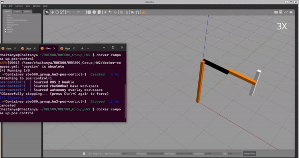
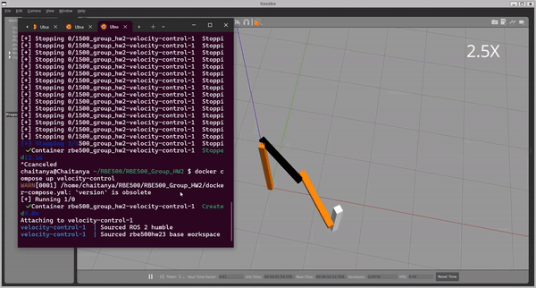

# rbe500-rrbot
This repo consists code for RBE500 final project that consists of various sub-projects on implementation of PD position control, velocity kinematics and velocity control of a scara robot arm (rrbot) created. For further information check the project problem statements and reports [here](docs/).
## Steps to setup and run the simulation
- For this project Ubuntu 20.04 with ROS2 Humble is used.
- Requires docker and docker-compose setup as prerequisite.
- Clone the repo to a folder.
- In that folder run the command:
	```
	docker compose build
	```
- This takes some time to build the images.
- Once built run the following command to open the Gazebo with rrbot:
	```
	docker compose up sim
	```
- For part 2 (or HW2), open another terminal and in the folder where we cloned the repo run:
	```
	docker compose up effort-controller
	docker compose up position-control-servicecall
	```
- Open another terminal and in the same folder run:
	```
	docker compose up pos-control
	```
- In another terminal, in the folder run:
	```
	docker compose up main-controller
	```
- For part 3 (or HW3) to run the velocity controller, open new terminal and run:
	```
	docker compose up initial-position
	docker compose up effort-controller
	docker compose up joint-to-endeffector2
	```
- In another terminal:
	```
	docker compose up velocity-control
	```

## Results
The results for the position control(on left) and velocity control(on right) are shown here and remaining results and plots can be found in the reports [here](docs/).
<p float="middle">
	 
	
</p>

## Reference
- [Utilized the following resource for docker setup](https://roboticseabass.com/2023/07/09/updated-guide-docker-and-ros2/)
	
